#  Projects and things I'm proud of
-----------------------------------------------------------------------------------------

  
My working area at ElRecycling    

  
  
  
 
---------------------------------------------------------------------------------------------

Home server setup:  
  
A Rasperry Pi runs as a dedicated media server of copyright-free movies and files. (qBittorrent, Minidlna, Samba) 
A small form factor PC running on Ubuntu acts as a NextCloud server for automated picture backup and data hosting.

  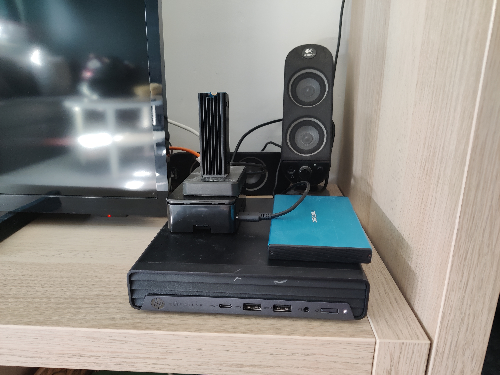

---------------------------------------------------------------------------------------------

Tailscale connected devices that I have remote access to. (RDP,CMD,FTP,SMB)
  
  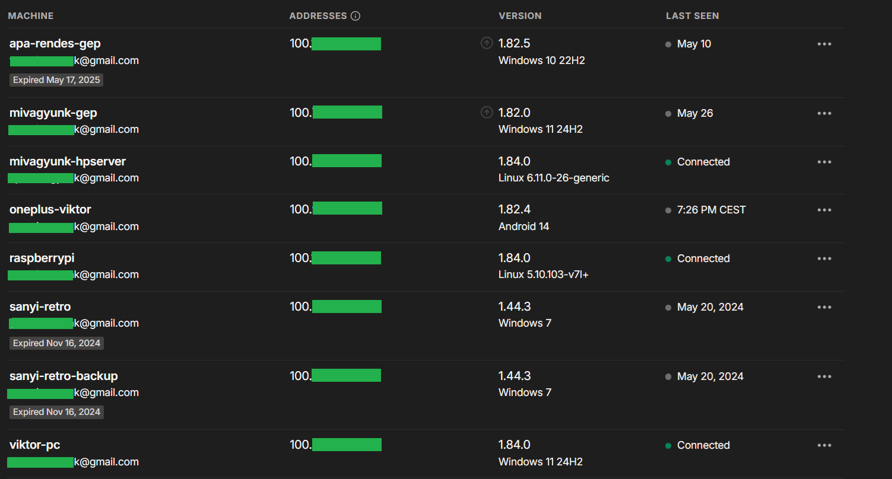

---------------------------------------------------------------------------------------------

During my internship in 2019, I rebuilt and modernized an Elementary School's network. The backbone topology consisted of 5 layer 3 switches, 6 APs, 2 Servers and a Router.
The entire project lasted for around 2 months, this included the evaluation, planning, rollout and documentation of the network.  
  
  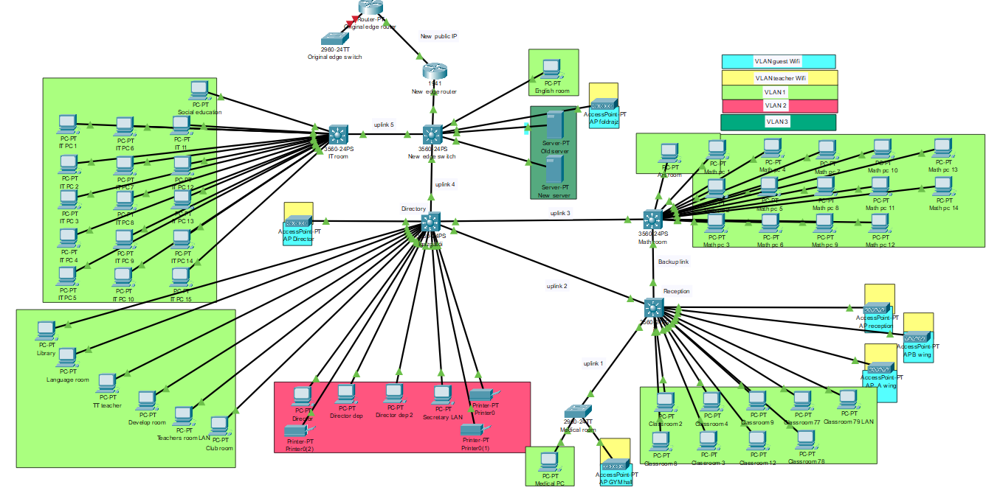

---------------------------------------------------------------------------------------------

As an IT consultant at Senpage, I was responsible for developing a prototype in Figma of an online retail marketplace. Among other tasks, I conducted user tests, translated insights into UX and UI design iterations, and formulated the metric that was used to generate ESG information of the marketplace items. 
  
  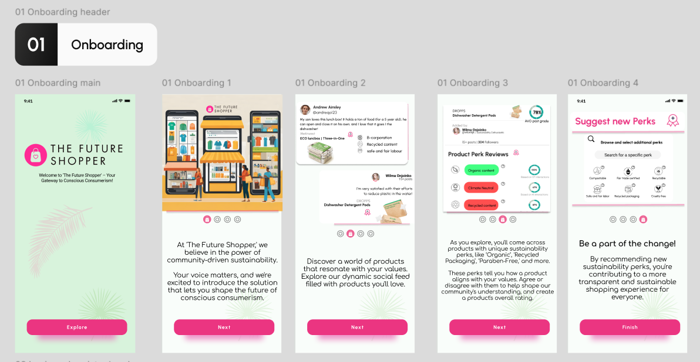 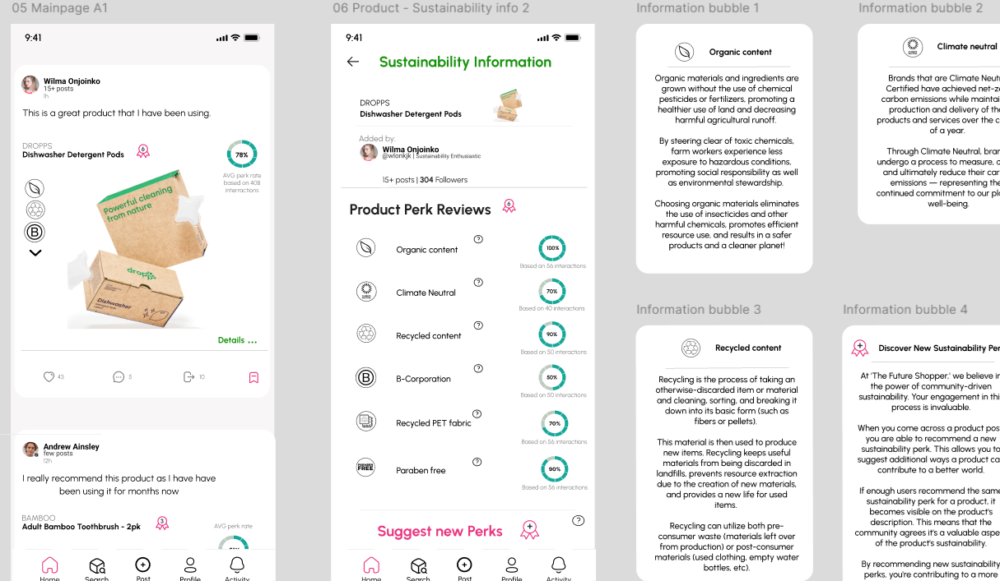

---------------------------------------------------------------------------------------------

Ender 3v2 3D printer monitoring with Raspberry Pi  
Official Pi camera package was used for streaming video [Code](code/Picamera.sh), and I used Ngrok's service to access the feed from a public IP. 
My basic Setup, and a few models I printed and painted. [definitely a Star Wars nerd].

  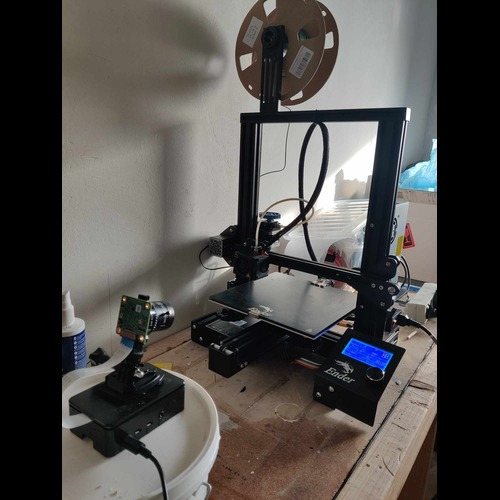
  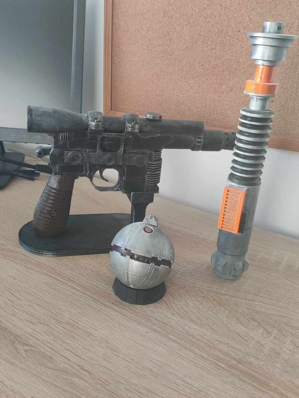

---------------------------------------------------------------------------------------------

I built my own PC:  
MB:  Asus Z690+Wifi,  
CPU: i9-13900KF with Arctic Liquid Freezer III 360 AIO,  
GPU: Zotac GeForce RTX 3090 Trinity,  
RAM: Kingston Fury Beast 64GB DDR5,  
PSU: ROG-STRIX-1000G,  
Montech Air 1000 cabinet,  

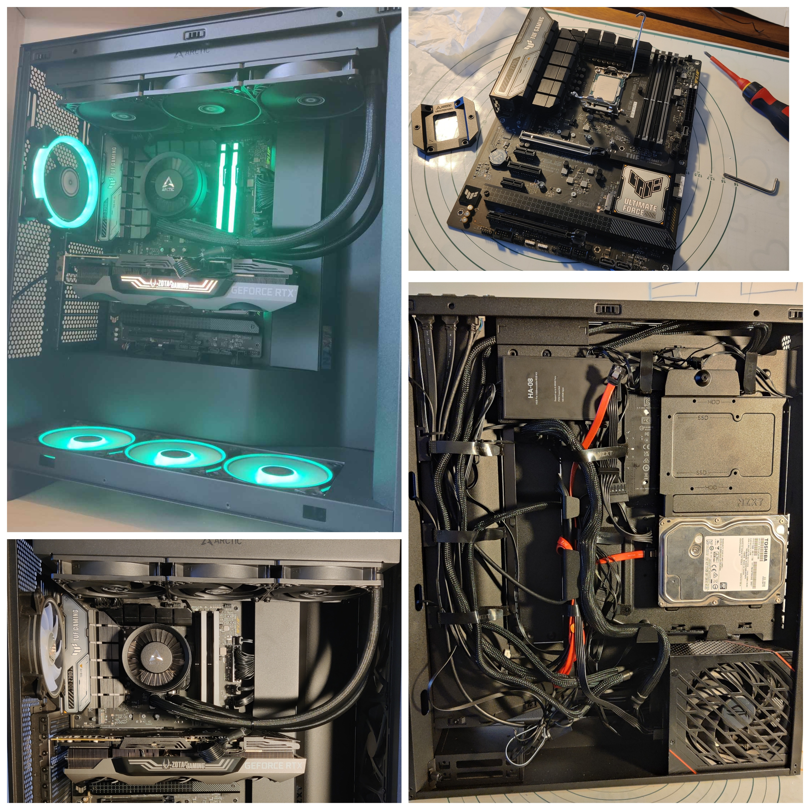

---------------------------------------------------------------------------------------------

I carried out the entire renovation of my apartment myself, except from the in-wall plumbing and the main circuit breaker replacement.  
The bathroom and kitchen were the biggest challenges.  

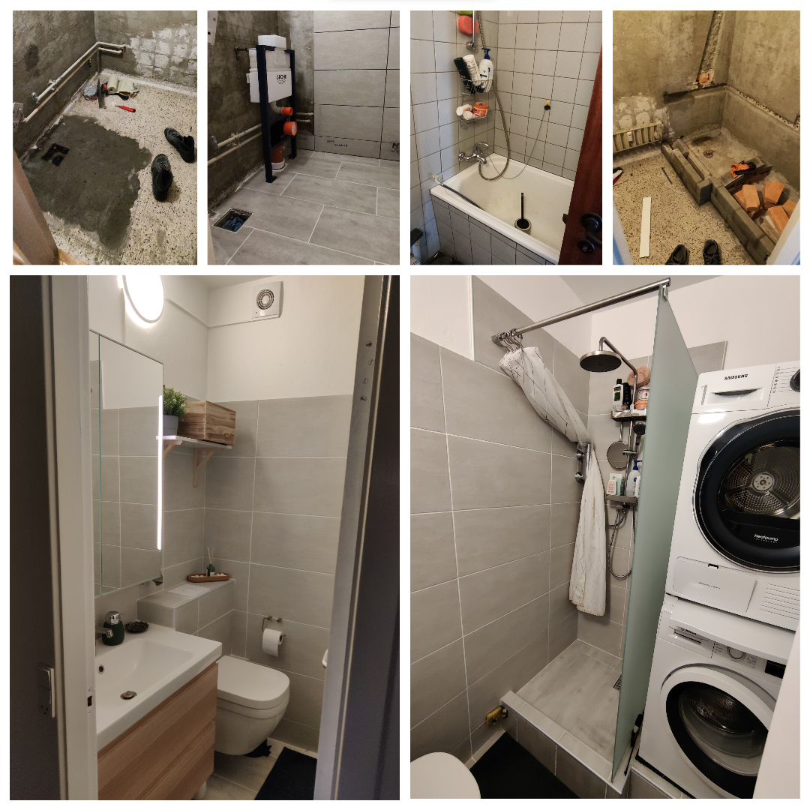
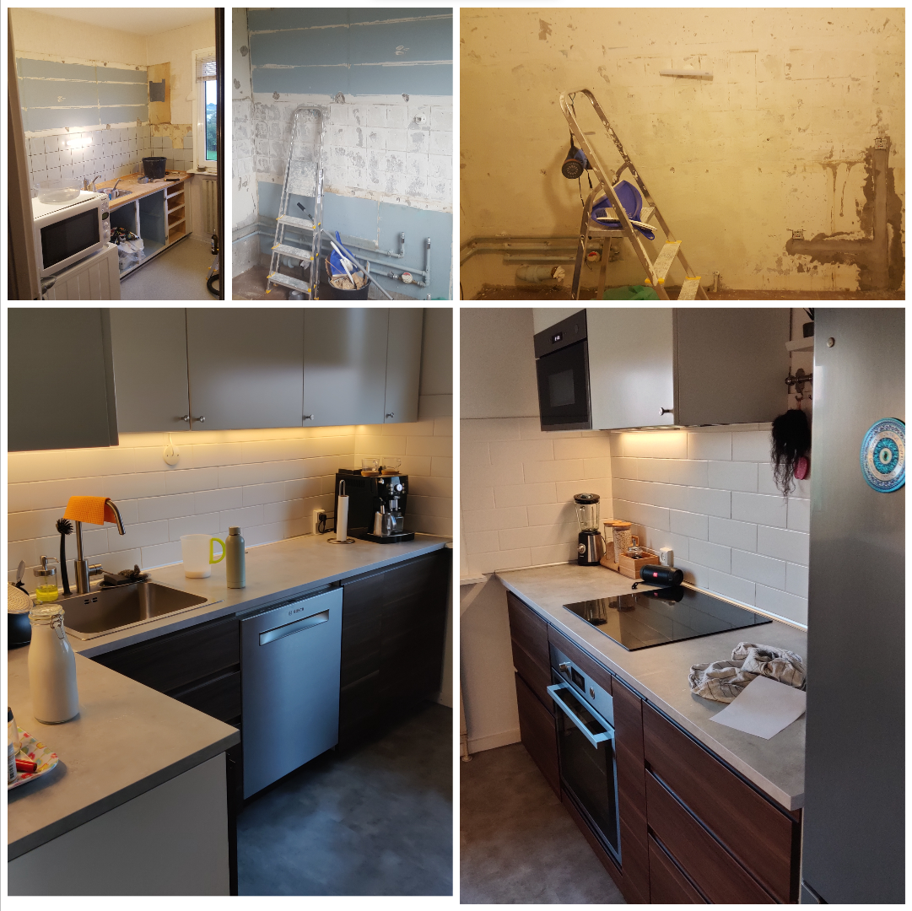

---------------------------------------------------------------------------------------------

2023, Norway Trolltunga. The trip was around 29km with 2500m ascend.
2024, 2 days of walking from Aarhus to Silkeborg, Sum of 81km.

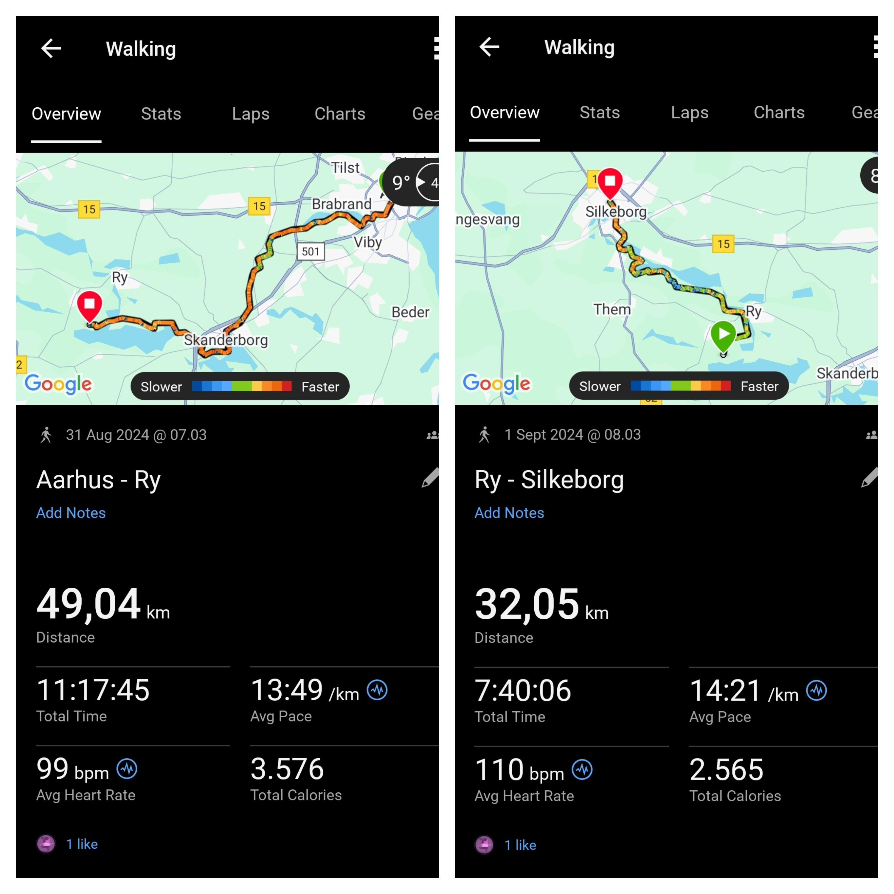
  

---------------------------------------------------------------------------------------------

