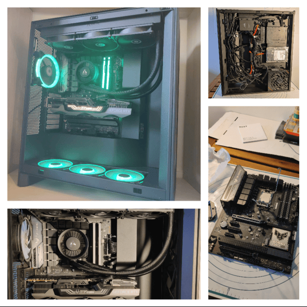
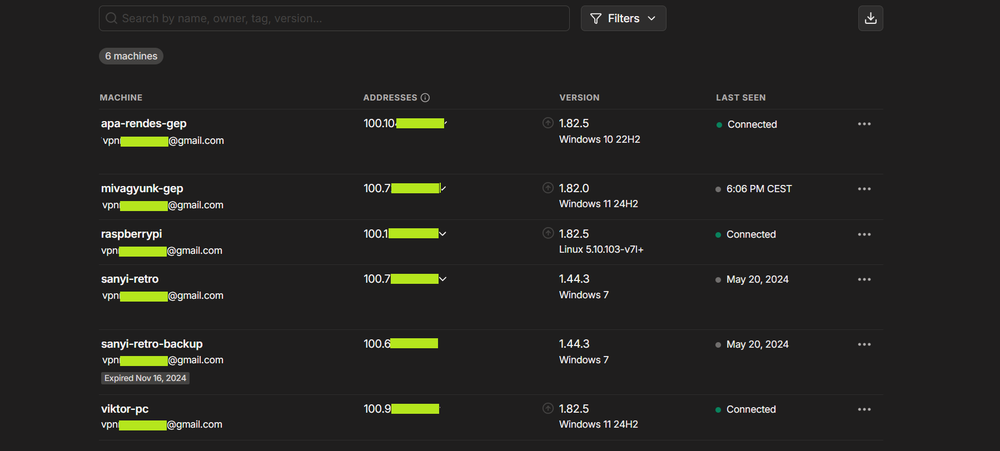

# Some of my main projects that I am proud of
---------------------------------------------------------------------------------------------
** Ender 3v2 3D printer monitoring with Raspberry Pi  
Official Pi camera package was used for streaming video [Code](code/Picamera.sh), and I used Ngrok's service to access the feed from a public IP. 
Basic Setup  
  

A few models that I printed and painted. [definitely a Star Wars nerd]. I also have CAD skills in fusion 360.

---------------------------------------------------------------------------------------------

I built my own PC:  
MB:  Asus Z690+Wifi,  
CPU: i9-13900KF with Arctic Liquid Freezer III 360 AIO,  
GPU: Zotac GeForce RTX 3090 Trinity,  
RAM: Kingston Fury Beast 64GB DDR5,  
PSU: ROG-STRIX-1000G,  
Montech Air 1000 cabinet,  

---------------------------------------------------------------------------------------------

** During my internship in 2019, I rebuilt and modernized an Elementary School's network. The backbone topology consisted of 5 layer 3 switches, 6 APs, 2 Servers and a Router.
The entire project lasted for around 2 months, this included the evaluation, planning, rollout and documentation of the network.  

---------------------------------------------------------------------------------------------

** Tailscale connected devices that I have remote access to. (GUI,CMD)

---------------------------------------------------------------------------------------------

** I carried out the entire renovation of my apartment myself, except from the in-wall plumbing and the main circuit breaker replacement.  
The bathroom and kitchen were the biggest challenges. 
   
  
  

---------------------------------------------------------------------------------------------

